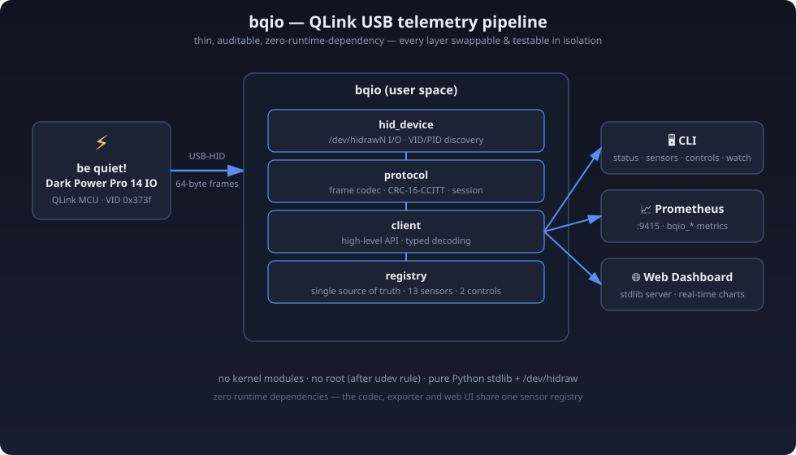

<div align="center">

# ⚡ bqio

**Lightweight Linux CLI & user-space driver for the be quiet! Dark Power Pro 14 IO PSU — over USB-HID.**

No kernel modules. No vendor software. No runtime dependencies. Just Python and a reverse-engineered QLink protocol.

> **Keywords:** be quiet! · Dark Power Pro 14 IO · QLink · USB-HID · Linux driver · Prometheus exporter · Grafana · PSU monitoring · homelab · fan control · rail telemetry

[](https://www.python.org/)
[](https://github.com/acer-pseudoplatanus/dark-power-pro-14-io-linux/actions/workflows/ci.yml)
[](LICENSE)
[](#-protocol)
[](#-sensor-reference)
[](#-controls)
[](#-installation)
[](#-development)

</div>

---

## 📖 About

The **Dark Power Pro 14 IO** ships with a USB cable and a Windows-only companion app. On Linux, the PSU simply sits there — silent, invisible, unmonitored.

This project closes that gap:

- 🔌 Speaks the PSU's proprietary **QLink protocol** directly over **USB-HID** (vendor ID `0x373f`, 64-byte report frames, CRC-16-CCITT)
- 📊 Exposes **23 live sensors** — AC input, six 12V rails, 5V & 3.3V rails, temperature, fan speed, uptime, error state
- 🎛️ Provides **2 controls** — fan mode (semi-passive / performance) and rail mode (multi / single)
- 📈 Ships a **Prometheus exporter** for seamless homelab monitoring
- 🖥️ Includes a **real-time web dashboard** (pure stdlib — no framework, no build step)
- 🧪 Tested against **112 real captured frames** from a physical PSU (fixture regression suite)

Everything runs in **user space** — no kernel modules, no root required beyond USB permissions.

> ⚠️ **Disclaimer** — The QLink protocol is **reverse-engineered** from packet captures of the official vendor tool. It is undocumented and may change without notice. Use with your own hardware at your own risk.

---

## 🚀 Quick Start

```bash
# 1. Clone
git clone https://github.com/acer-pseudoplatanus/bqio.git
cd bqio

# 2. Install (zero runtime dependencies — this just makes the console scripts)
pip install .

# 3. Talk to your PSU
bqio detect          # find the HID device node
bqio info            # device info, serial, supported features
bqio sensors         # dump all sensor values once
```

Expected output of `bqio sensors`:

```
[ 0] uptime_seconds             = 1234567.0
[ 1] total_runtime_seconds      = 89012345.0
[ 2] fan_speed_rpm              = 1240.0
[ 3] temperature_celsius        = 41.0
[ 4] error_state                = 0.0
[ 5] ac_input_power_watts       = 421.1
[ 6] ac_input_voltage_volts     = 231.4
[ 7] rail_3v3_current_amps      = 1.02
[ 8] rail_3v3_voltage_volts     = 3.31
[ 9] rail_5v_current_amps       = 3.14
[10] rail_5v_voltage_volts      = 5.02
[11] rail_12v1_current_amps     = 28.31
[12] rail_12v1_voltage_volts    = 12.04
```

*(Sample output — values vary with load.)*

---

## ✨ Features

- 🧪 **Zero runtime dependencies** — reads the stock `/dev/hidraw` character device directly; the kernel's `usbhid` driver already hands us the 64-byte reports, so no `hidapi`/`libusb` binding is needed
- 📡 **23 sensors** — full rail telemetry incl. uptime & cumulative runtime
- 🎚️ **2 controls** — fan mode + rail mode
- 📊 **Prometheus exporter** — persistent-session sampler thread, last-good-value caching, sanity-bound filtering, derived DC power & efficiency metrics
- 🖥️ **Web dashboard** — real-time charts, dark theme, served by the stdlib HTTP server (also serves `/metrics`)
- 🐍 **Clean CLI** — `detect`, `info`, `sensors`, `controls`, `watch`, `close-orphan`
- 🧱 **Strictly layered** — transport / codec / client / registry / front-ends, each testable in isolation
- 🧾 **Fixture regression tests** — the codec is validated against 112 real captured frames with ground-truth values
- 📝 **Fully documented** — sensor reference, protocol notes, architecture, contributing guide

---

## 📦 Installation

### Requirements

| Component | Minimum | Notes |
|-----------|---------|-------|
| Python | 3.9 | 3.12 recommended |
| Linux | 5.x | any modern distro with `usbhid` |
| Runtime deps | **none** | stdlib only |

### USB permissions

Ship a `udev` rule so a dedicated service user can talk to the device:

```bash
# /etc/udev/rules.d/99-bqio.rules  (included in this repo under udev/)
SUBSYSTEM=="hidraw", ATTRS{idVendor}=="373f", ATTRS{idProduct}=="0023", TAG+="systemd", MODE="0660", GROUP="bqio"
```

Then reload:

```bash
sudo udevadm control --reload && sudo udevadm trigger
```

Unplug and replug the PSU's USB cable afterwards.

### Running the exporter as a service

A hardened `systemd` unit ships in [`systemd/`](systemd/):

```bash
sudo useradd -r -s /sbin/nologin bqio
sudo cp systemd/bqio-psu-exporter.service /etc/systemd/system/
sudo cp udev/99-bqio.rules /etc/udev/rules.d/
sudo udevadm control --reload && sudo udevadm trigger
sudo systemctl enable --now bqio-psu-exporter
```

---

## 💻 CLI Usage

```bash
# Find the HID device node (walks sysfs by VID/PID — never assumes hidraw0)
bqio detect

# Device info, serial number, supported feature bitmap
bqio info

# Dump all sensor values once
bqio sensors

# Dump all control values once
bqio controls

# Sample sensors repeatedly (10 samples by default)
bqio watch -n 20

# Diagnose/close an orphaned session left by a crashed process
bqio close-orphan

# Global flags
bqio --device /dev/hidraw2 -v sensors
```

---

## 📈 Prometheus Exporter

The exporter listens on **:9415** and publishes **23 sensor metrics** under the `bqio_` namespace, plus health gauges:

| Metric | Unit | Type |
|--------|------|------|
| `bqio_uptime_seconds` | s | gauge |
| `bqio_total_runtime_seconds` | s | gauge |
| `bqio_fan_speed_rpm` | rpm | gauge |
| `bqio_temperature_celsius` | °C | gauge |
| `bqio_error_state` | — | gauge |
| `bqio_ac_input_power_watts` | W | gauge |
| `bqio_ac_input_voltage_volts` | V | gauge |
| `bqio_rail_3v3_current_amps` | A | gauge |
| `bqio_rail_3v3_voltage_volts` | V | gauge |
| `bqio_rail_5v_current_amps` | A | gauge |
| `bqio_rail_5v_voltage_volts` | V | gauge |
| `bqio_rail_12v1_current_amps` | A | gauge |
| `bqio_rail_12v1_voltage_volts` | V | gauge |
| `bqio_rail_12v2_current_amps` | A | gauge |
| `bqio_rail_12v2_voltage_volts` | V | gauge |
| `bqio_rail_12v3_current_amps` | A | gauge |
| `bqio_rail_12v3_voltage_volts` | V | gauge |
| `bqio_rail_12v4_current_amps` | A | gauge |
| `bqio_rail_12v4_voltage_volts` | V | gauge |
| `bqio_rail_12v5_current_amps` | A | gauge |
| `bqio_rail_12v5_voltage_volts` | V | gauge |
| `bqio_rail_12v6_current_amps` | A | gauge |
| `bqio_rail_12v6_voltage_volts` | V | gauge |
| `bqio_dc_output_power_watts` | W | gauge (derived) |
| `bqio_efficiency_ratio` | 0–1 | gauge (derived) |
| `bqio_up` | 0/1 | gauge |
| `bqio_data_age_seconds` | s | gauge |
| `bqio_scrape_duration_seconds` | s | gauge |
| `bqio_info_model_id` | — | gauge (static) |
| `bqio_info_revision` | — | gauge (static) |
| `bqio_info_mcu_fw_major` / `_middle` / `_minor` | — | gauge (static) |
| `bqio_info_qlink_major` / `_middle` / `_minor` | — | gauge (static) |
| `bqio_info_kv_entries` | — | gauge (static) |

Design notes:

- A **persistent session** is held by a background sampler thread — scrapes are instant (they read the cache), so Prometheus scrape intervals never hammer the MCU.
- **Last-good-value caching** keeps dashboards alive across transient USB hiccups.
- **Sanity bounds** drop physically impossible readings (e.g. a 5.9e14 °C firmware glitch) and keep the last good value.

Example `prometheus.yml` scrape config (see [`examples/prometheus.yml`](examples/prometheus.yml)):

```yaml
scrape_configs:
  - job_name: "bqio_psu"
    static_configs:
      - targets: ["psu.example.net:9415"]
```

---

## 🖥️ Web Dashboard

A small real-time dashboard (dark theme, auto-refreshing charts) served by the stdlib HTTP server — no framework, no bundler, no build step:

```bash
python -m bqio.web --port 8080
# → http://localhost:8080          (dashboard)
# → http://localhost:8080/metrics  (Prometheus text, identical to the exporter)
```

Already running Prometheus + Grafana? The exporter plugs straight in.

---

## 🗂️ Repository Structure

```
bqio/
├── README.md                 # ← you are here
├── CONTRIBUTING.md           # dev workflow, PR checklist
├── DELIVERY_SPEC.md          # code contract (binding)
├── LICENSE                   # MIT
├── Makefile                  # quality-gate shortcuts
├── requirements.txt          # DEV toolchain only (zero runtime deps!)
├── pyproject.toml            # packaging + tool config
├── .editorconfig
├── .github/
│   ├── ISSUE_TEMPLATE/
│   │   ├── bug_report.md
│   │   └── feature_request.md
│   ├── PULL_REQUEST_TEMPLATE.md
│   └── workflows/
│       └── ci.yml            # ruff + mypy + pytest (3.9–3.12)
├── bqio/                     # 🐍 the package
│   ├── __init__.py           # version
│   ├── __main__.py           # `python -m bqio` → CLI
│   ├── hid_device.py         # transport: /dev/hidraw I/O + sysfs discovery
│   ├── protocol.py           # QLink codec: framing, CRC-16, value decode
│   ├── client.py             # session-aware high-level API
│   ├── registry.py           # single source of truth: sensors & controls
│   ├── cli.py                # diagnostic CLI
│   ├── exporter.py           # Prometheus exporter (:9415)
│   └── web.py                # stdlib web dashboard
├── docs/
│   ├── ARCHITECTURE.md       # design decisions
│   ├── PROTOCOL.md           # reverse-engineered QLink notes
│   └── images/
│       └── architecture.svg
├── examples/
│   └── prometheus.yml        # sample scrape config
├── systemd/
│   └── bqio-psu-exporter.service
├── udev/
│   └── 99-bqio.rules
└── tests/
    ├── conftest.py           # fixture loader + fake transport
    ├── test_protocol.py      # codec unit tests
    ├── test_registry.py      # registry invariants
    ├── test_hid_device.py    # transport (synthetic sysfs)
    ├── test_client.py        # session/API (fake transport)
    ├── test_exporter.py      # renderer (seeded cache)
    ├── test_web.py           # dashboard helpers
    ├── test_fixtures.py      # REGRESSION: 112 real captured frames
    └── fixtures/             # *.bin frames + manifest.json (ground truth)
```

### Architecture



---

## 📡 Protocol

The PSU speaks a proprietary **QLink** protocol over a single HID report pipe:

- **Frames:** fixed 64-byte HID reports — length, session ID, request ID, family, command, payload, CRC-16-CCITT trailer
- **Families:** `ROOT` (session open/close), `DEVINFO`, `SENSORS`, `CONTROLS`
- **Session:** host opens a session (`ROOT/OPEN` with client type), receives a session ID, all subsequent frames carry it
- **Integrity:** CRC-16-CCITT (poly `0xA001`, init `0xFFFF`) over the full frame minus the trailer
- **Value encoding:** typed little-endian payloads (uint/int 8–64 bit, half & float) declared per sensor
- **Polling:** host-initiated, ~1 Hz for telemetry

See [`docs/PROTOCOL.md`](docs/PROTOCOL.md) for the full frame layout.

---

## 📊 Sensor Reference

| # | Metric | Unit | Notes |
|---|--------|------|-------|
| 0 | `uptime_seconds` | s | session-relative uptime |
| 1 | `total_runtime_seconds` | s | cumulative lifetime runtime |
| 2 | `fan_speed_rpm` | rpm | — |
| 3 | `temperature_celsius` | °C | — |
| 4 | `error_state` | — | `0` = OK |
| 5 | `ac_input_power_watts` | W | — |
| 6 | `ac_input_voltage_volts` | V | — |
| 7 | `rail_3v3_current_amps` | A | — |
| 8 | `rail_3v3_voltage_volts` | V | — |
| 9 | `rail_5v_current_amps` | A | — |
| 10 | `rail_5v_voltage_volts` | V | — |
| 11 | `rail_12v1_current_amps` | A | — |
| 12 | `rail_12v1_voltage_volts` | V | — |
| 13 | `rail_12v2_current_amps` | A | present in protocol, inactive on this hardware revision |
| 14 | `rail_12v2_voltage_volts` | V | present in protocol, inactive on this hardware revision |
| 15 | `rail_12v3_current_amps` | A | present in protocol, inactive on this hardware revision |
| 16 | `rail_12v3_voltage_volts` | V | present in protocol, inactive on this hardware revision |
| 17 | `rail_12v4_current_amps` | A | present in protocol, inactive on this hardware revision |
| 18 | `rail_12v4_voltage_volts` | V | present in protocol, inactive on this hardware revision |
| 19 | `rail_12v5_current_amps` | A | present in protocol, inactive on this hardware revision |
| 20 | `rail_12v5_voltage_volts` | V | present in protocol, inactive on this hardware revision |
| 21 | `rail_12v6_current_amps` | A | present in protocol, inactive on this hardware revision |
| 22 | `rail_12v6_voltage_volts` | V | present in protocol, inactive on this hardware revision |

### Controls

| Command | Values | Notes |
|---------|--------|-------|
| `fan_mode` | `semi_passive` \| `performance` | `0` = semi-passive, `1` = performance |
| `rail_mode` | `multi` \| `single` | `0` = multi-rail, `1` = single-rail |

---

## 🛠️ Development

Quality gates (all enforced in CI, runnable locally via `make check`):

```bash
python -m venv .venv
.venv/bin/pip install -r requirements.txt   # dev toolchain only
.venv/bin/pip install -e .

make check    # ruff + mypy + pytest (with coverage)
```

The test suite runs **without hardware**: the codec is validated against 112 real captured frames (`tests/fixtures/`), the client against a fake transport, and the exporter renderer against a seeded cache.

---

## 🤝 Contributing

Contributions are welcome! Please read [`CONTRIBUTING.md`](CONTRIBUTING.md) first — it covers the dev setup, the capture → decode → implement workflow, and the PR checklist.

Quick path:

1. Fork & clone
2. `pip install -r requirements.txt && pip install -e .`
3. Make your change (keep the sensor table in sync with the registry!)
4. Run `make check`
5. Open a PR

---

## 📄 License

[MIT](LICENSE) © acer-pseudoplatanus

---

<div align="center">

**Built for the homelab. Powered by curiosity.** ⚡

</div>
